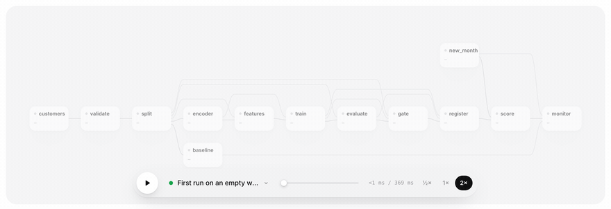
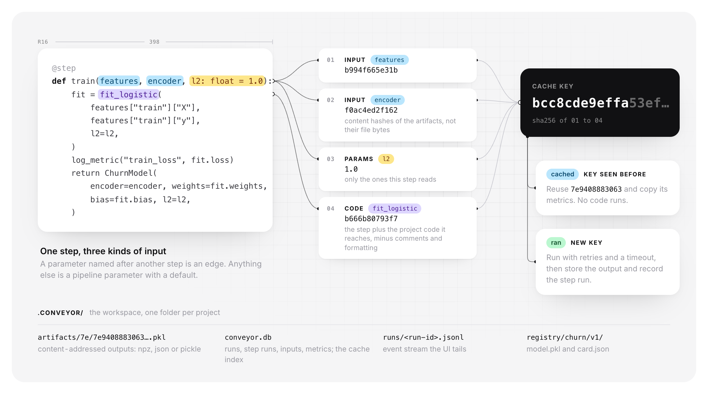
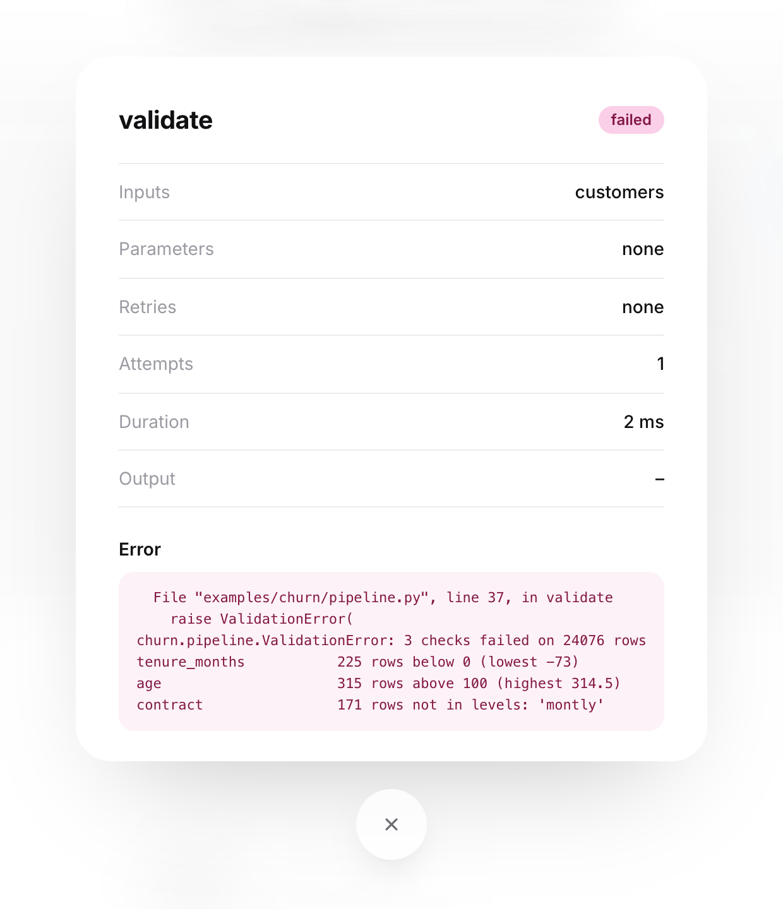
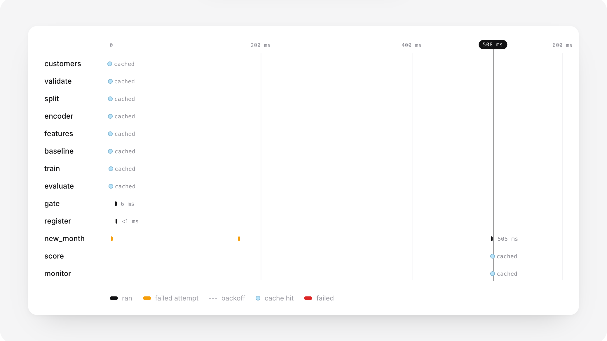
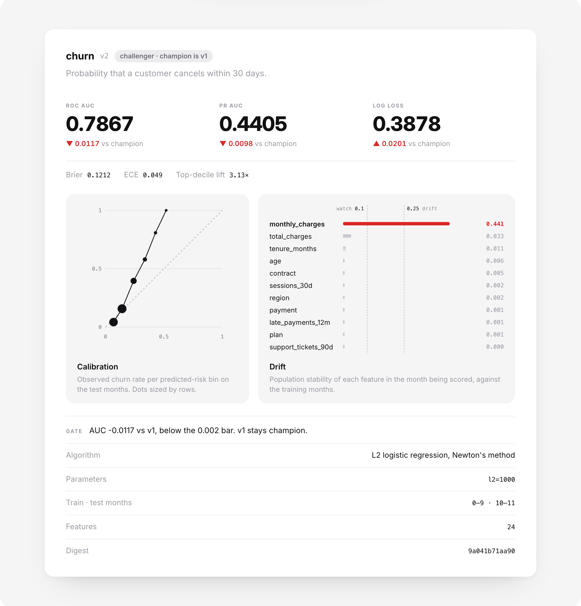

# conveyor

A small pipeline engine for ML in plain Python: steps wired by parameter name, a content-addressed cache, retries, lineage in SQLite and a live run view, with numpy as the only dependency.

<p align="center"></p>

<p align="center">
  <a href="https://github.com/Stxqq/conveyor/actions/workflows/ci.yml"></a>
  <a href="https://stxqq.github.io/conveyor/"></a>
  <a href="LICENSE"></a>
  
  
</p>

<p align="center">
  <a href="https://stxqq.github.io/conveyor/"><picture>
      <source media="(prefers-color-scheme: dark)" srcset=".github/assets/launch-dark.png">
      
    </picture></a>
  <a href="https://github.com/Stxqq/conveyor"><picture>
      <source media="(prefers-color-scheme: dark)" srcset=".github/assets/star-dark.png">
      
    </picture></a>
  <br />
  <sub>If you found it useful, a star helps more people find it.</sub>
</p>

## Why

Most ML pipelines I've worked on had the same needs: rerun only what changed,
know which data and code produced a model, survive a flaky warehouse read, and
refuse to ship a model that's worse than the one in production. The big
orchestrators do all of that and bring a scheduler, a database server and a
deployment story with them. conveyor is the part you actually need on a laptop
or in a CI job, in about 2,500 lines of Python you can read in an afternoon.

```python
from conveyor import Pipeline, log_metric, step


@step
def customers(seed: int = 7):
    return simulate(24_000, seed)


# `features` is another step, so it's an edge; `l2` is a parameter.
@step
def train(features, l2: float = 1.0):
    model = fit(features["X"], features["y"], l2)
    log_metric("train_loss", model.loss)
    return model


pipeline = Pipeline("churn", [customers, validate, features, train])
```

## How it works

<p align="center"></p>

The hashes in the picture are real ones, from the `train` step of the first
recorded run in `docs/runs/cold.json`.

A step's parameter names are its inputs. A name that matches another step is
an edge, anything else is a pipeline parameter with a default. `Pipeline(...)`
rejects duplicate names, cycles (`cycle: a -> b -> c -> a`), unknown inputs
(`evaluate(modl): no step named 'modl' … did you mean 'model'?`) and two steps
that disagree on a parameter's default. Steps start the moment their inputs
exist, on a thread pool; numpy releases the GIL, so for array work that is real
parallelism.

The cache key covers the step's source with decorators, comments and
formatting stripped, so reformatting doesn't invalidate anything. It also
follows the step into your own code: every function, class and module it
refers to that lives in the project rather than in the standard library or
site-packages is hashed too, recursively (a module used as `scoring.roc_auc`
counts as its whole file), along with the values of constants they read and of
variables a step closes over. Edit a helper three calls deep
and the steps that reach it rerun; upgrade numpy and nothing does. For
anything it can't see, like a file a step opens, bump `@step(version=...)`.
Inputs are hashed by content rather than by file bytes, so a step whose code
changed but whose output didn't leaves everything downstream cached. Arrays and
dicts of arrays are stored as `.npz`, JSON-safe values as `.json`, everything
else is pickled.

Some steps aren't functions of their inputs. The churn example's `gate` reads
the model registry and `register` writes to it, so both are marked
`@step(cache=False)` and run every time; replaying an old decision would
disagree with what the registry holds now. Their outputs are still
content-addressed, so when the answer comes out the same, the steps after them
stay cached.

Retries use exponential backoff with equal jitter, and `retry_on` limits which
exceptions are worth retrying. A timed-out attempt is abandoned (Python can't
kill a thread), counts as a failure, and anything it logs after that is
dropped. When a step fails, everything downstream of it is `skipped`,
independent branches finish, and the run is `failed`.

Every step run records its cache key, inputs, output artifact and metrics, and
successful step runs double as the cache index. `Lineage.upstream(artifact)`
walks back to the raw data, `producer` finds the run that actually computed an
artifact, `consumers` finds every run that used it.

## The example: a churn model, end to end

`examples/churn/pipeline.py` is the kind of pipeline a subscription business
runs every month, on seeded synthetic data with the usual mess: missing ages,
blank totals for new customers, billing glitches recorded at ten times the
price, and rows the export job shipped twice.

```
customers ─▶ validate ─▶ split ─┬─▶ encoder ─▶ features ─▶ train ─▶ evaluate ─▶ gate ─▶ register
                                │                                                          │
                                └─▶ baseline ───────────────┐                              ▼
new_month ─────────────────────────────────────────────▶ monitor ◀───────────────────── score
                                                    (main edges only)
```

| step | what it does |
|------|--------------|
| `customers` | 24,000 customer-month snapshots over 12 months, churn rate rising over the year |
| `validate` | schema, range, level and missing-rate checks; fails fast with one line per problem; drops duplicate rows |
| `split` | time-based: months 0–9 train, 10–11 test |
| `encoder` / `features` | median impute + missing flags, clip at the 0.5/99.5 percentiles, log1p on heavy tails, standardise, one-hot; fit on train only |
| `train` | L2 logistic regression by Newton's method in numpy (converges in 7 iterations) |
| `evaluate` | ROC AUC, PR AUC, log loss, Brier, a 10-bin calibration table and ECE, top-decile lift |
| `gate` | scores the current champion on the same test months; promotes only if AUC improves by `min_auc_gain`; never cached |
| `register` | versioned registry with a model card (metrics, calibration, top drivers, params, data window, caveats); never cached |
| `new_month` | next month's customers after a 12% price increase; can be made flaky to exercise retries |
| `score` | batch-scores the new month with the champion |
| `monitor` | PSI per feature against the training months, `watch` at 0.1, `drift` at 0.25 |

## Quickstart

```bash
git clone https://github.com/Stxqq/conveyor && cd conveyor
python3 -m venv .venv && . .venv/bin/activate
pip install -e '.[dev]'

conveyor run examples/churn/pipeline.py
conveyor run examples/churn/pipeline.py -p l2=1000
conveyor ui    # http://localhost:5300
```

Python 3.10 or newer; numpy is the only runtime dependency.

Or `make demo`, `make test`, `make ui`. With Docker:

```bash
docker build -t conveyor .
docker run --rm -v conveyor-data:/data conveyor conveyor run examples/churn/pipeline.py
docker run --rm -v conveyor-data:/data -p 5300:5300 conveyor
docker run --rm -v conveyor-data:/data -p 8000:8000 conveyor conveyor serve churn --host 0.0.0.0
```

## Usage

A cold run (output trimmed to the second half):

```
$ conveyor run examples/churn/pipeline.py
churn  run 20261001-161954-463d  13 steps, 8 workers, cache on
  ...
  succeeded  train           6 ms   pickle   1.2 kB
                        newton_iterations 7   train_loss 0.334
  succeeded  evaluate        2 ms   json     1.5 kB
                        roc_auc 0.7985   pr_auc 0.4503   log_loss 0.3677   brier 0.1147
                        ece 0.02983   lift_top_decile 3.187   base_rate 0.1646
  succeeded  gate            0 ms   json      109 B
                        no champion yet
  succeeded  register        2 ms   json       52 B
                        registered churn:1, champion is v1
  succeeded  score           4 ms   table   19.7 kB
                        scored 2007   mean_score 0.1451   high_risk_share 0.01993
  succeeded  monitor         1 ms   json      911 B
                        psi_max 0.4407   features_drifting 1
                        monthly_charges: PSI 0.441 (drift)

succeeded in 372 ms  13 ran, 0 cached, 0 failed, 0 skipped
```

Run it again and only the two registry steps execute. The gate sees that the
challenger already is the champion, `register` finds the same model under v1,
and `score` and `monitor` come from the cache:

```
  succeeded  gate            6 ms   json      131 B
                        already the champion
  succeeded  register        0 ms   json       52 B
                        registered churn:1, champion is v1
  cached     score                  table   19.7 kB
  cached     monitor                json      911 B

succeeded in 40 ms  2 ran, 11 cached, 0 failed, 0 skipped
```

Change a parameter and only the steps that read it, or depend on something
that changed, run again. Here the challenger is worse, so the champion stays.
`score` reruns against the unchanged champion, produces the same artifact
hash as before, and `monitor` stays cached:

```
$ conveyor run examples/churn/pipeline.py -p l2=1000
  ...
  succeeded  gate            3 ms   json      218 B
                        auc_gain -0.01175
                        AUC -0.0117 vs v1, below the 0.002 bar
  succeeded  register        1 ms   json       52 B
                        registered churn:2, champion is v1
  succeeded  score           1 ms   table   19.7 kB
  cached     monitor                json      911 B

succeeded in 59 ms  5 ran, 8 cached, 0 failed, 0 skipped
```

Feed it a bad export and it stops before training anything. Every check that
failed gets its own line, in the terminal and in the run viewer:

<p align="center"></p>

```
$ conveyor run examples/churn/pipeline.py -p corrupt=0.03
  cached     new_month              table   34.9 kB
  succeeded  customers      83 ms   table  395.0 kB
  failed     validate        6 ms   churn.pipeline.ValidationError: 3 checks failed on 24076 rows
  skipped    split      upstream validate failed
  ...
failed in 105 ms  1 ran, 1 cached, 1 failed, 10 skipped

validate failed after 1 attempt(s)
  File "examples/churn/pipeline.py", line 37, in validate
churn.pipeline.ValidationError: 3 checks failed on 24076 rows
tenure_months           225 rows below 0 (lowest -73)
age                     315 rows above 100 (highest 314.5)
contract                171 rows not in levels: 'montly'
```

Retries, with the jittered delays:

```
$ conveyor run examples/churn/pipeline.py -p flaky_reads=2
  retry      new_month  attempt 1 failed (ConnectionError: warehouse read timed out (attempt 1)), again in 0.13s
  retry      new_month  attempt 2 failed (ConnectionError: warehouse read timed out (attempt 2)), again in 0.29s
  succeeded  new_month     449 ms   table   34.9 kB
```

Inspecting what happened:

```
$ conveyor runs
20261001-162001-e257  churn      succeeded     481 ms  3 ran  10 cached                        just now
20261001-162001-f5e5  churn      failed        105 ms  1 ran  1 cached  1 failed  10 skipped   just now
20261001-161955-55ca  churn      succeeded      59 ms  5 ran  8 cached                         just now
20261001-161955-1076  churn      succeeded      40 ms  2 ran  11 cached                        just now
20261001-161954-463d  churn      succeeded     372 ms  13 ran  0 cached                        just now

$ conveyor models
churn
  v1    7e9408883063  roc_auc 0.7985   pr_auc 0.4503   log_loss 0.3677  champion
  v2    9a041b71aa90  roc_auc 0.7867   pr_auc 0.4405   log_loss 0.3878

$ conveyor show latest            # steps, artifacts, metrics, errors
$ conveyor show latest --json     # the same as JSON
$ conveyor show latest --events   # the raw event stream
```

Serving the champion:

```
$ conveyor serve churn --port 8000
$ curl -s localhost:8000/predict -d '{"rows": [
    {"tenure_months": 3, "contract": "monthly", "plan": "premium", "payment": "invoice",
     "region": "south", "monthly_charges": 95, "sessions_30d": 2,
     "support_tickets_90d": 3, "late_payments_12m": 1},
    {"tenure_months": 50, "contract": "two_year", "plan": "basic", "payment": "card",
     "region": "north", "monthly_charges": 29, "sessions_30d": 60}]}'
{"model": "churn:1", "predictions": [0.8843669454075289, 0.002125106410198807]}
```

`conveyor ui` serves the run viewer on port 5300 with a small JSON API:
`/api/runs`, `/api/runs/<id>`, `/api/runs/<id>/events`, `/api/runs/<id>/stream`
(server-sent events, live while the run is going), `/api/artifacts/<id>` for
lineage and `/api/models` for the registry. The page shows the runs list, the
graph filling in as steps start, finish or come from the cache, a timeline of
every attempt and backoff, and the model card with its calibration and drift.
The [live demo](https://stxqq.github.io/conveyor/) is the same page with no
server behind it: `make site` copies it next to the recorded runs in
`docs/runs/` and it replays those instead.

<p align="center">
  
  
</p>

From Python:

```python
from conveyor import Executor, load_pipeline

pipeline = load_pipeline("examples/churn/pipeline.py")
executor = Executor(".conveyor")
executor.run(pipeline)
result = executor.run(pipeline, {"l2": 3.0})
result.status, result.count("cached")  # ('succeeded', 8)
result.output("evaluate")["roc_auc"]  # 0.79847
```

## Project layout

```
conveyor/
  step.py        @step: inputs from parameter names, retries, timeout, cache opt-out
  fingerprint.py the code hash: a step's source and the project code it reaches
  dag.py         Pipeline: validation, topological order, params
  executor.py    scheduling, cache lookups, retries, timeouts, failure propagation
  hashing.py     content hashes and cache keys
  store.py       artifact store and serializers
  lineage.py     SQLite: runs, step runs, artifacts, metrics, lineage queries
  events.py      JSON-lines event stream
  registry.py    versioned models with a champion pointer
  serve.py       JSON predict endpoint
  cli.py         conveyor run | runs | show | models | ui | serve
  ui/            API server and the frontend
examples/churn/  data, features, Newton logistic regression, metrics, PSI, pipeline
scripts/         record_demo.py (docs/runs/*.json), assert_cached.py (CI)
tests/           70 Python tests; tests/ui/ runs under node --test (npm test)
```

## Results

Measured on an Apple M4 Pro (14 cores), Python 3.11, numpy 2.4, while three
other builds were running on the same machine, so read the timings as upper
bounds. The per-step overhead in particular moved between 0.45 and 1.2 ms from
one run to the next.

| | |
|---|---|
| churn pipeline, cold (median of 5, fresh workspace) | 331 ms for 13 steps |
| churn pipeline, rerun: 11 cache hits, gate and register run (median of 5) | 8.9 ms |
| engine overhead per step (200-step chain of tiny steps, cache on) | 0.45–1.2 ms |
| 64 independent 50 ms steps, 1 worker vs 8 workers | 3.73 s vs 0.49 s (7.6x) |
| test suite | 70 Python tests in 7.3 s, 7 frontend tests in 0.1 s |

Churn model on the two held-out months (4,058 rows, 16.5% churn):

| ROC AUC | PR AUC | log loss | Brier | ECE | top-decile lift |
|---|---|---|---|---|---|
| 0.7985 | 0.4503 | 0.3677 | 0.1147 | 0.030 | 3.19x |

The 12% price increase in the scoring month shows up where it should:
`monthly_charges` PSI 0.441 (drift), `total_charges` 0.033, everything else
below 0.011.

## References

- Tom Fawcett, *An introduction to ROC analysis* (2006), for AUC as the
  Mann–Whitney statistic with tied scores counted as half.
- Marc Brooker, *Exponential Backoff And Jitter*, AWS Architecture Blog (2015),
  for the equal-jitter retry schedule.
- Bilal Yurdakul, *Statistical Properties of Population Stability Index* (2018),
  on PSI and the usual 0.1 / 0.25 rules of thumb.
- Mitchell et al., *Model Cards for Model Reporting* (2019), for what goes into `card.json`.
- Ideas borrowed from DVC (content-addressed outputs), Dagster and Hamilton
  (dependencies from parameter names) and MLflow (registry with a champion alias).

## License

MIT © 2026 Stefan Carapic
